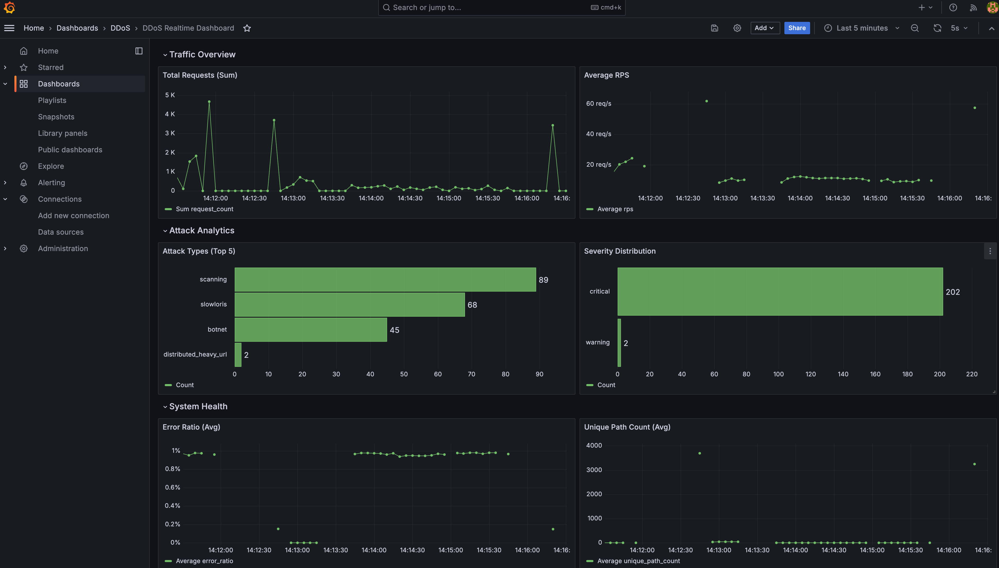

# DDoS Detection Pipeline (Kafka + Spark + Elasticsearch + Grafana)

This project simulates real-time web traffic, detects DDoS behavior with Spark Structured Streaming, sends alerts through Kafka and Telegram, and visualizes everything in Grafana.

## 1. Project Goals

- Generate both normal traffic and multiple attack patterns.
- Detect anomalies using rule-based streaming windows (2s/5s/60s).
- Store alerts in daily Elasticsearch indices.
- Monitor events in real time with a Grafana dashboard.

## 2. Architecture Overview


Main components:

- `src/producer`: Generates traffic data and attack scenarios.
- `src/spark-app`: Processes stream data and detects DDoS signals.
- `src/alerts`: Consumes alerts, deduplicates with Redis, and sends Telegram notifications.
- `src/datawarehouse`: Bootstraps Elasticsearch and Kafka Connect sink.
- `src/dashboards`: Grafana dashboard and provisioning files.

## 3. Simulated Attack Types

- HTTP Flood (high-volume GET/POST).
- Distributed botnet traffic.
- Search/Heavy Query Flood.
- Sensitive endpoint scanning (`/.env`, `/wp-admin`, ...).
- Slowloris-like behavior.
- Distributed heavy URL spike.

## 4. Environment Requirements

- Docker + Docker Compose.
- Make (recommended).
- At least 8 GB RAM for stable local execution.

## 5. Setup

### Option A: One command to start the full stack and open dashboard

```bash
make dashboard
```

What this command does:

1. Runs `docker compose up -d --build` to build and start all services.
2. Waits until Grafana is healthy and ready.
3. Opens the dashboard URL in your default browser automatically.

Grafana login (default): `admin/admin`.
If you changed credentials in your environment config, use those values.

### Option B: Manual startup

```bash
make up
make ps
```

Then open the dashboard manually:

```text
http://localhost:3000/d/ddos_dashboard/ddos-realtime-dashboard?orgId=1
```

Checkpoint note:

- By default, Spark now uses `SPARK_CHECKPOINT_DIR=/data/checkpoints/spark-job-v2-*`.
- `*` is replaced by a run id (timestamp), so each run creates a new checkpoint folder.
- You no longer need to delete old checkpoint folders after each code update.
- Optional: set `SPARK_CHECKPOINT_RUN_ID` to control the suffix manually.

## 6. Useful Makefile Commands

```bash
make help      # list available commands
make up        # build and start all services
make down      # stop the stack
make restart   # restart all services
make logs      # follow real-time logs
make ps        # show container status
make dashboard # run setup and open Grafana dashboard
make clean     # stop stack and remove orphans
make score     # run personal project quality scoring
```

## 7. Environment Configuration (.env)

Create `.env` from `.env.example` and adjust values as needed.

Important variables:

- Kafka topics: `INPUT_TOPIC`, `OUTPUT_TOPIC`
- Kafka bootstrap: `KAFKA_BOOTSTRAP_SERVERS`
- Simulator: `SIMULATOR_BASE_RPS`
- Alerting: `ALERT_MIN_SEVERITY`, `TELEGRAM_TOKEN`, `TELEGRAM_CHAT_ID`
- Grafana URL params: `GRAFANA_HOST`, `GRAFANA_PORT`, `GRAFANA_DASHBOARD_UID`, `GRAFANA_DASHBOARD_SLUG`

## 8. Dashboard Panels

- Total Requests (sum)
- Average RPS
- Attack Types (Top 5)
- Severity Distribution
- Error Ratio
- Unique Path Count



## 9. Detailed Data Flow

1. The producer publishes simulated HTTP events to `network-traffic`.
2. Spark consumes Kafka stream data, normalizes records, and applies detection rules.
3. Spark publishes alerts to `ddos-alerts`.
4. Kafka Connect sink writes alerts into daily Elasticsearch indices.
5. Grafana queries Elasticsearch for real-time visualization.
6. The alert service consumes alerts, deduplicates with Redis, and sends Telegram messages.
