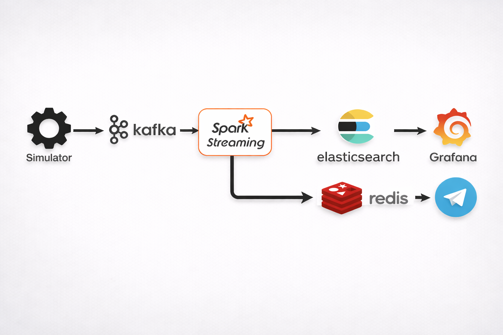

# DDoS Detection Pipeline (Kafka + Spark + Elasticsearch + Grafana)

Project mô phỏng traffic web thời gian thực, phát hiện hành vi DDoS bằng Spark Structured Streaming, gửi cảnh báo qua Kafka/Telegram và hiển thị dashboard trên Grafana.

## 1. Mục tiêu dự án

- Sinh traffic bình thường + traffic tấn công theo nhiều pattern.
- Detect bất thường theo cửa sổ thời gian (2s/5s/60s) với rule-based streaming.
- Lưu alert vào Elasticsearch theo index ngày.
- Quan sát realtime bằng Grafana dashboard.

## 2. Kiến trúc tổng quan



Thành phần chính:

- `src/producer`: sinh dữ liệu traffic và kịch bản tấn công.
- `src/spark-app`: xử lý stream + phát hiện DDoS.
- `src/alerts`: consume alert, dedup Redis, gửi Telegram.
- `src/datawarehouse`: bootstrap Elasticsearch + Kafka Connect sink.
- `src/dashboards`: dashboard và provisioning Grafana.

## 3. Các kiểu tấn công đang mô phỏng

- HTTP Flood (GET/POST volume lớn).
- Botnet traffic phân tán.
- Search/Heavy Query Flood.
- Scanning endpoints nhạy cảm (`/.env`, `/wp-admin`, ...).
- Slowloris-like behavior.
- Distributed heavy URL spike.

## 4. Yêu cầu môi trường

- Docker + Docker Compose.
- Make (khuyến nghị).
- Tối thiểu 8GB RAM để chạy stack ổn định.

## 5. Chạy nhanh (khuyến nghị)

### Cách 1: 1 lệnh mở full stack + dashboard

```bash
make dashboard
```

Script sẽ:

1. `docker compose up -d --build`
2. chờ Grafana sẵn sàng
3. tự mở dashboard trên trình duyệt mặc định

Login Grafana: mặc định `admin/admin` (hoặc thông tin bạn cấu hình).

### Cách 2: chạy thủ công

```bash
make up
make ps
```

Mở dashboard:

```text
http://localhost:3000/d/ddos_dashboard/ddos-realtime-dashboard?orgId=1
```

## 6. Các lệnh Makefile hữu ích

```bash
make help      # danh sách lệnh
make up        # build + start toàn bộ services
make down      # stop stack
make restart   # restart stack
make logs      # xem logs realtime
make ps        # trạng thái container
make dashboard # chạy setup + mở Grafana dashboard
make clean     # down + remove orphans
make score     # chấm điểm quality dự án cá nhân
```

## 7. Cấu hình môi trường (.env)

Tạo file `.env` từ `.env.example` và chỉnh theo nhu cầu.

Biến quan trọng:

- Kafka topics: `INPUT_TOPIC`, `OUTPUT_TOPIC`
- Kafka bootstrap: `KAFKA_BOOTSTRAP_SERVERS`
- Simulator: `SIMULATOR_BASE_RPS`
- Alerting: `ALERT_MIN_SEVERITY`, `TELEGRAM_TOKEN`, `TELEGRAM_CHAT_ID`
- Grafana open URL: `GRAFANA_HOST`, `GRAFANA_PORT`, `GRAFANA_DASHBOARD_UID`, `GRAFANA_DASHBOARD_SLUG`

## 8. Dashboard gồm gì

- Total Requests (sum)
- Average RPS
- Attack Types (Top 5)
- Severity Distribution
- Error Ratio
- Unique Path Count
- Recent Alerts

## 9. Luồng dữ liệu chi tiết

1. Producer phát event HTTP giả lập vào `network-traffic`.
2. Spark đọc stream Kafka, chuẩn hóa dữ liệu và chạy bộ rule detection.
3. Spark đẩy alert sang topic `ddos-alerts`.
4. Kafka Connect sink ghi alert vào Elasticsearch index theo ngày.
5. Grafana query Elasticsearch để hiển thị realtime.
6. Alert service nhận alert, deduplicate bằng Redis, gửi Telegram.

## 10. Troubleshooting nhanh

### Grafana không lên

```bash
make logs
docker compose logs -f grafana
```

### Không thấy dữ liệu trên dashboard

- Kiểm tra producer và spark-app đang chạy:

```bash
docker compose ps
docker compose logs -f producer spark-app
```

- Kiểm tra connector ES:

```bash
docker compose logs -f kafka-connect connect-init
```

### Dashboard không tự mở

- Mở thủ công URL:

```text
http://localhost:3000/d/ddos_dashboard/ddos-realtime-dashboard?orgId=1
```

## 11. Giới hạn hiện tại

- Chưa có test tự động đầy đủ (unit/integration).
- Rule detection hiện chủ yếu dựa trên threshold heuristics.
- Chưa có CI workflow để validate tự động khi push code.

## 12. Hướng cải thiện tiếp theo

- Thêm test cho detector logic và alert pipeline.
- Thêm GitHub Actions cho lint + test + build.
- Pin version dependencies để tăng khả năng tái lập môi trường.
- Bổ sung benchmark kết quả detect (precision/recall, false positive rate).
